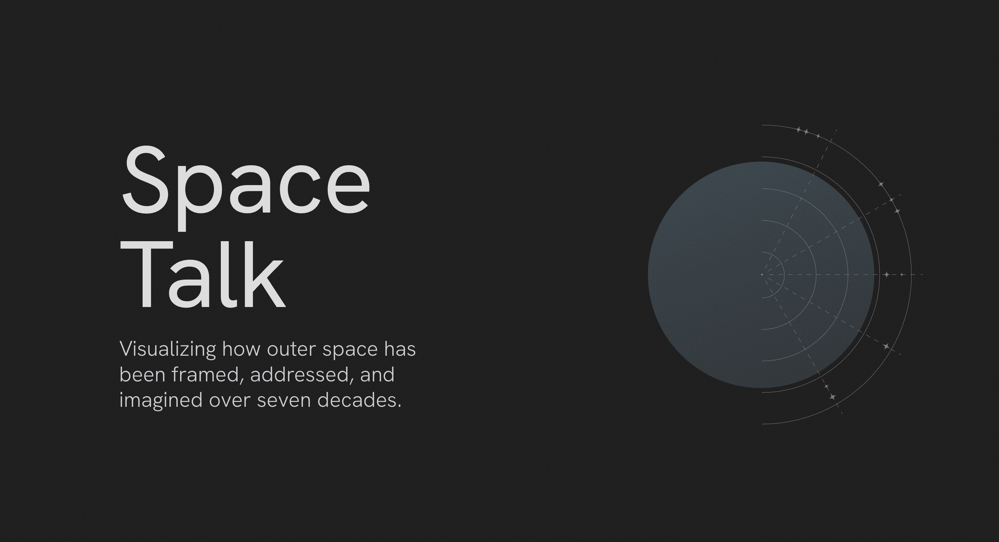

# Space Talk
### Visualizing how outer space has been framed, addressed, and imagined over seven decades.

by Lara Yeyati Preiss

Demo: https://lara-yeyati-preiss.github.io/space-talk/talking_about_space.html

## Abstract
"Outer space is a domain as symbolic as it is physical. From the Cold War space race to the rise of commercial spaceflight, the material history of space exploration has unfolded alongside a parallel history of narrative: how space has been framed, contested, and imagined.

Drawing on natural language processing and semantic analysis, this project maps that narrative history of space exploration across seven decades, tracing how outer space has been discussed in media coverage, political rhetoric, and science fiction literature. Alongside this record of talking about space runs its counterpart: a record of talking to space, visualized through a catalog of cultural artifacts and messages sent beyond Earth, from family photographs to radio signals.

Together, these layers frame outer space as a cultural and political object, exploring what its construction reveals about the societies that looked up at it."

